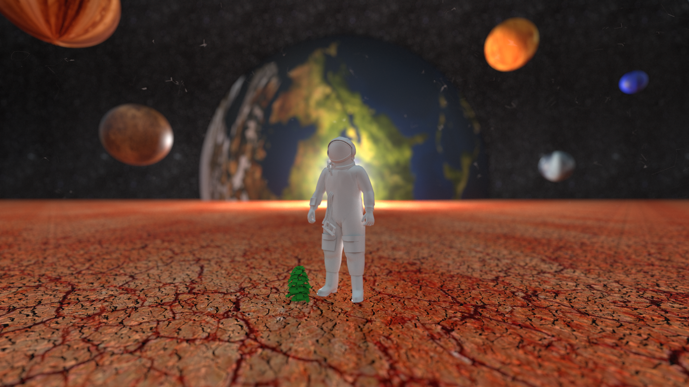

# Computer Graphics (ETHZ Fall Semester 22)
This repository consists of the report for the final project of the course [Computer Graphics course AS 22](https://cgl.ethz.ch/teaching/cg22/home.php) at ETH Zurich, completed by me and my teammate [Ankita Ghosh](https://ankitaghosh9.github.io/).
  
The final image is rendered using Nori framework. Course assignment
and project instructions can be viewed [here](https://cgl.ethz.ch/teaching/cg22/www-nori/index.html#project).
  
Project Report : Can be viewed [here](https://sayands.github.io/computer-graphics-project-report/).
  
Final Scene: **Man on Mars**
   

